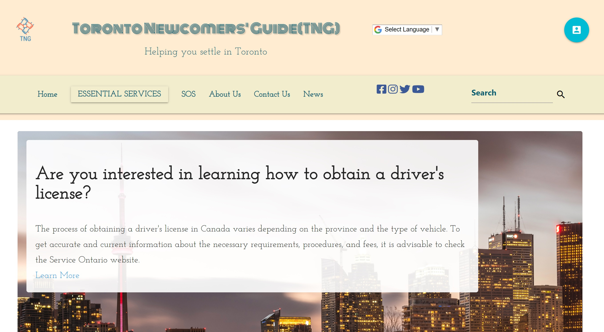

# Toronto Newcomers' Guide (TNG) 

### Navigate and Adapt to the Greater Toronto Area With Ease.

---

## Badges

---

## Description

>Welcome to the Toronto Newcomers' Guide! This platform is crafted specifically for newcomers to the Greater Toronto Area (GTA). The guide aims to provide you with valuable information to ease your transition and adaptation to your new environment. Whether you are a student, refugee, temporary resident, or permanent resident, we've got you covered. Here's what you can expect:

- User Registration: Create a personalized account and select your profile type to get recommendations tailored to your needs.
- Interactive Map: Browse through essential places like healthcare centers, public transport, schools, and more.
- Language Support: Need the content in a different language? We've integrated Google Translate to provide you with a seamless experience.
- Essential Guides & Tips: Gain access to articles and information specifically tailored for newcomers to the GTA.
- Personalized Dashboard: Once logged in, your dashboard will provide you with links and recommendations based on your selected profile type.
- News Feed: Stay updated with local news courtesy of our Mediastack news API integration.

_The Toronto Newcomers' Guide is your comprehensive resource for a smooth start in the GTA._

---

## Features

>This platform comes with an array of features that aim to make your transition to the GTA as smooth as possible:

1. User Registration: We have a secure login system complete with sign-up, sign-in, and logout functionalities. The system checks for all types of validations to ensure a secure experience.
2. Profile-Based Dashboard: After registering, your dashboard will be populated with recommendations based on your selected profile type: student, refugee, temporary resident, or permanent resident.
3. Interactive Map: Utilizing Google Maps and Places APIs, we provide an interactive map where you can find key locations like grocery stores, hospitals, and public transport stations.
4. Language Translation: Through Google Cloud Translation API, you can translate the site's content into your preferred language effortlessly.
5. Essential Guides & Tips: This section provides a myriad of articles and tips tailored to your needs, using reliable sources and community contributions.
6. Local News: Stay informed with current events relevant to the GTA via our news section, powered by Mediastack News API.
7. Libraries and APIs: This application is built using jQuery, Materialize CSS for responsive UI, DayJS for date and time manipulation, Google Fonts, and FontAwesome for icons.

_Browse, interact, and get comfortable in your new surroundings with Toronto Newcomers' Guide._

---

## Installation
### N/A

---

## Usage

>Here is how you can get the most out of the Toronto Newcomers' Guide:

1. Access the Platform: Open the Toronto Newcomers' Guide in your preferred browser. Register or log in to access the personalized dashboard.
2. Profile Selection: During the registration process, choose your profile type (e.g., student, refugee, temporary resident, or permanent resident).
3. Dashboard: Once registered and logged in, you'll be greeted with personalized recommendations and links based on your selected profile type.
4. Interactive Map: Use the map to locate essential places and services. Click on markers for more details and directions.
5. Language Selection: If you require translations, use the language toggle to translate the site's content into your preferred language.
6. Essential Guides & Tips: Navigate to this section to find articles and guides to help you adapt to the GTA.
7. Local News: Stay updated with current events by visiting our news feed section.

---

## Future Enhancements (Stretch Goals)

>We aim to continually improve the Toronto Newcomers' Guide by adding the following features in future updates:

- Feedback and Reviews
- Improve Maps and News features
- Expanding Profile Types
- List of Events and Workshops
- Enhancing the user interface for the login section
- Additional options for recommendations on the dashboard
- Search bar
- Storing your preferred events and destinations

_We welcome your feedback and suggestions to make this guide even better for all newcomers to the GTA._

---

## Credits

*Followed Tutorial Websites and Documentations*

[W3Schools](https://www.w3schools.com/jquery/)
[jQuery Tutorials](https://learn.jquery.com/using-jquery-core/)
[Dayjs](https://day.js.org/docs/en/display/format)
[Materialize CSS](https://materializecss.com/)

---

## Used Libraries and APIs

### Libraries and Frameworks

[jQuery](https://jquery.com/)
[Materialize CSS](https://materializecss.com/)
[dayJS](https://day.js.org/en/)
[Google Fonts](https://fonts.google.com/)
[Fontawesome](https://fontawesome.com/)

### APIs

[Google Maps](https://developers.google.com/maps)
[Google Places](https://maps.googleapis.com)
[Cloud Translation](https://cloud.google.com/translate)
[Mediastack](https://mediastack.com/documentation)

---

## Contact US

[Code Brakers Gmail](uoftbootcamp.group3@gmail.com)

---

## Live URL

[TNG]( https://uoftgroup3.github.io/toronto-newcomers-guide/)
